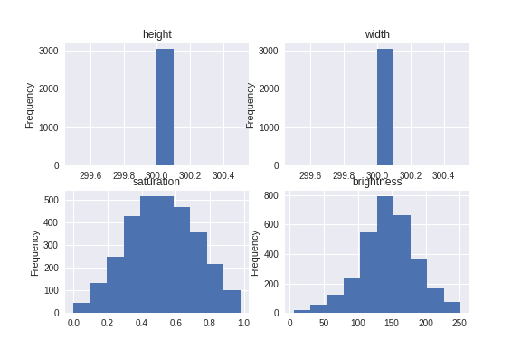
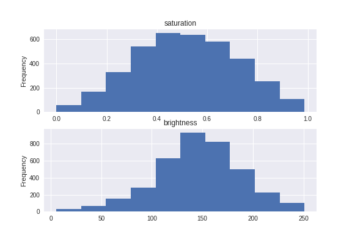
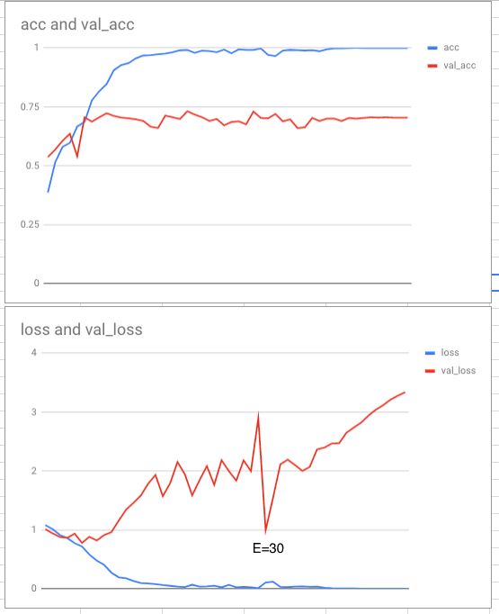

Project structure outline in project structure doc. 

## Introduction

My process is outlined by the struture of this report: EDA, training set sampling, MLP/Baseline model, ImageNet models, custom architecture CNN, and conclusion. The ImageNet models were very interesting to research and I tried variations of their architectures in my model, ending up with something relatively simple. I think the critical points in my report are sampling and training data size. I ran models primarily on Google's amazing Colab system, but in the early stages I was also trying to run them on my laptop. 

## Exploratory Data Analysis - notebooks/EDA.ipynb

To start my EDA, I looked around online for ways to aggregate image data. The top plots show the width and height of the images- mercifully all the same size. The bottom plots show the distributions of the average brightness and color saturation of my training images. Both are lightly left skewed distributions, indicating my images are tend to be bright and colourful. 

```{r echo=FALSE, out.width="300px"}

```

_A plot showing height, width, brightness and saturation for the training data before deletion._

### Sampling

I'm going to build a single sequential model to handle the task of identifying and classifying fruit. Thus, when I went through the training images, I focused on images that were dominated by the fruit in question. I manually looked through all the images, although mostly just glancing, to find images that definitely didn't belong. The main issues I found, in order of importance were:

1. Incorrect labels. 
2. Mixed classes. 
3. Images with significant visual distraction from the class target.
4. Some drawings. 
5. Some resized, distorted, cropped images (pre-transformed!). 
6. Images from the same scene but from different angles. 

There are two types of problem here: things that will break my classifier (1, 2, 3), and things that will make training more difficult (3, 4, 5, 6). I deleted the images that violated the first 3 points, and left the others. 

Significant visual distraction belongs in both classes, because it is a spectrum: how robust do I want my classifier to be? How much do I trust my model design to find and identify images? I tried to be consistent, but consistency can be hard to achieve as a mere human person.

The latter class will make the classifier more robust in a good way. By introducing noise to the training data, they help to avoid overfitting and encourage a parameterisation that will be able to detect in images where the fruit is not front and center. However, this being my first CNN, I'm nervous about forcing the model to mix object detection and classification. I assume that it is easier to classify something correctly when it has already been identified as being a fruit.

As you may know, the original dataset had even thirds. My final training data set had:

* Tomato: 36.3%, 1356
* Cherry: 37.9%, 1428
* Strawberry: 25.8%, 971

I have a total of `r 1356+1428+971` training images (`r round((1356+1428+971)/4500*100,1)`% of the original data). Although the balance is now off between classes, I still think those classes are sufficiently large to (when they can all be used in the training process) successfully train a classifier. It's definitely not a sparse class situation.

Checking the saturation and brightness values, they look relatively unchanged for this cleansed dataset. 

```{r echo=FALSE, out.width="300px"}

```

_A plot showing height, width, brightness and saturation for the training data **after** deletion._

### Pre-processing 

I couldn't find any references to preprocessing for CNNs. The division of pixel values by 255 in the import statement (in the assignment code) is a form of normalisation. My CNN will find appropriate features via the convolution process. I will rely on architecture changes to be successful in predictions.

## Training Wheels: Self-validation.

Using the 309 seed, I split my data into training and test sets. The code is contained in the data_base.py file. 

I followed the PEP8 standard and tried to write in an object-oriented pattern that would facilitate deployment on a Python server (I'm a statistician so it's still something I'm working on). Check out custom_cnn.py for reference. 

I used both my laptop and Google Colab. My laptop doesn't have the hardware to support proper training. The datasets crush the CPU. When I trained on my laptop I used smaller datasets than I did on colab and the models always always always performed significantly worse. 

On both hardwares I used 20% validation to control for over training. However, when using an image generator in the fitting process (as opposed to pre-generating images into a directory for training), Keras doesn't permit using a validation set (like it normally does in the .fit command). 

I used the Adam optimiser. In other uses of SGD, assignment 3 and 4, Adam optimiser was faster and more accurate. RMSProp is better for recurrent nets (from the documentation) which is not what I am building. The other optimsers (ADA*s, Adam and other variants) didn't have any documentation justifying their use in this situation. 

I used categorical cross-entropy as the loss function. I tested categorical hinge, but it performed much worse on the same models. The sparse loss functions aren't necessary because no class is that sparse. Other loss functions were available, like MSE, MAE, but I chose categorical cross-entropy because it is designed for categorical problems.

I used RELU activations in the convolution layers. It is the staple of image recognition. In the dense layers I used sigmoid, but I tested using RELU, softmax and sigmoid in my dense layers. The sigmoid function performed best on the architectures I used. 

## Imagenet Models: People Who Are Smarter Than Me.

The code for this section is in the image_net.py file, as well as in the notebooks folder (for colab). 

I ran these models exclusive on colab. I had to restrict the training datset size because their architectures are so large. I split the training data out into train (2000) and test sets (200). 

Even with the lower training set sizes, the models would throw OOM warinings due to batch sizes. I had to use a batch size of 8. I had to run each model on a fresh boot of colab because colab doesn't free it's memory after a run. I used the same seed setting code as is in the assignment code base so each model was trained and tested on same data.

The models I chose were:

* 'dense': DenseNet169
* 'incep_v3': InceptionV3
* 'nas': NASNetMobile
* 'res': ResNet50
* 'xcept': Xception

I used the size of the model from [the keras documentation](https://keras.io/applications/) to select the five models above. I chose a few of the relatively smaller models. 

For each model I used *get_top=False*, so they came pre-made, with _weights='imagenet'_, but without a predictive layer. For the predictive layer I used a large dense RELU layer (arbitrarily 1024 units), a 50% dropout layer, and a predictive sigmoid layer. 

All of the models converged almost instantly. The ResNet showed the most promise for increased epochs by having the lowest use of the colab resources. 

Using categorical cross-entropy as the loss function, the results are:

```{r echo=FALSE,results='asis'}
imagenets = read.csv('./pretrained_scores_comparison.csv')
knitr::kable(imagenets[order(imagenets$loss,decreasing = F), c(3,2,1)])
```

Now, they had the same accruacy, which is weird. I know from training my custom CNN that this dataset trains much better when you reach at least 3000 images. That's not possible with networks this large. However, the Xception and NASNetMobile models outperformed the others on loss significantly. 

### Top Model: ImageNet Edition.

Xception is an interesting model because it has a whole "thing" going on. It uses separable convolution layers- layers that operate on the different colour channels (Chollet, Francois. (2017). Xception: Deep Learning with Depthwise Separable Convolutions. 10.1109/CVPR.2017.195.). It is an extension of the Inception model, but an _Extreme_ one, hence, (e)Xception.

NASNetMobile is another interesting CNN. NAS stands for Neural Architecture Search. The NASNet procedure is to use a RNN that samples from a population of networks. The sample is trained to convergence, and then updating the RNN. I think that the model I called was the result of having done this already. Google: "arXiv:1707.07012v4". Also, I think the NasNetMobile is designed to run on mobile devices. 

Lastly, there is also a model called VGG, which is comparatively vanilla. It uses paired convolution layers, with max pooling. But it is easy to understand.

Ffor my CNN, I think I will skip out the NAS. It seems a little extreme. I'll look at testing separable vs normal convolution layers, as well as the stacking of convolutions like VGG.

## Fruits of Labour: First Model.

For my first model, I made a shallow CNN. It is 2 layers of [2D convolution (64 filters, 3,3 masks) + max pooling] followed by a flattening and two dense layers. Running over a test set of 1280 on my laptop with batch sizes of 128, I scored a [Loss, Accuracy] of [1.276, 0.400]. Running the same model with a data generator worsened accuracy as well as increasing training time. 

I tried the same model with the categorical hinge loss function, still on my laptop, and it reduced accuracy to 26%.

On Colab, with a training set size (no generator) of 3500 I achieved [0.515, 0.94] in 20 epochs. I considered submitting that as my final model but my curiousity got the better of me. 

To use a generator on colab I had to use fewer images due to restriction on memory. I dropped down to 3000 samples. In ten epochs the model scored [0.750, 0.635]. However, accuracy was still increasing. It also took more time to run. 

## Separable vs Normal Layers: The Exception Test.

For my second round, I deepened my models and tried to test between normal and separable convolutional layers. At this point, it became clear that the training set sizes I was using on my laptop were never going to be useful.

On my laptop the model converged after step one. The training run *never* classified correctly on the validation set. The predictions from the classifier had trouble distinguishing between tomatoes and cherries. Not good.

On colab, the separable convolution model achieved a respectable [0.628, 0.765], and was still converging after 20 epochs. Validation accuracy was increasing during training until the second to last epoch, which worsened marginally. 

In the end, the deep normal convolution model on Colab out performed any of the other model architectures. Scoring a mighty [0.407, 0.93], making it a strong candidate for the final model. It also had strong performance in validation accuracy and was still converging after 20 epochs.

## VGG, (College) Dropout, and Reducing the Density of the predictive Layer.

Because the separable convolutions didn't perform well, I left them behind and moved towards a deep VGG model. The VGG model has two stages of convolution for every pooling layer and the number of filters in each layer doubles with depth. 

The model started throwing complaints about incorrect dimensionality between layers. To resolve this, I added padding. I'm not sure how this could affect predicitons, but I would guess it reduces internal detail. VGG is noted for aggressive use of pooling layers to down sample images.

Training on colab, this architecture took over ten epochs before accuracy started to turn up. I wonder if maybe different optimisers or seeds could have changed this but given that I already have strong performance from prior models I'm not too concerned with experimenting for this architecture. 

I ran two variants of the same model, with and without dropout in the final dense layer. Adding 50% dropout slightly improved performance of the model but both models scored similarly. The dropout architecture scored [0.765, 0.695] and was still converging at 20 epochs. 

## The Plot Thickens and Converges.

The VGG model didn't compare well with the baseline CNN, although possibly could have been better with more training epochs. I also have a personal preference for a lighter model over a heavier one. So, I thought I would try the depth of my final VGG model but with a single convolution per pooling layer. This model scored much better: [0.499, 0.925].

The other thing I tested was removing the last pooling layer before flattening into my dense layers. I wonder if maybe this problem prefers less agressive down sampling. After all, the most accurate model (so far) has only 2 layers of pooling. This architecture scored [0.409, 0.93], which I would posit supports the hypothesis that our training set doesn't like such aggressive architectures. That is also the best loss and the second best accuracy.

## Final Fruit Classifier

I extended the number of epohcs for training to find the correct train time. The winning architecture is:

* A sequential, 5 convolution layer model. 
* The convolution filters are all 2D.
* The convolution starts with a 64 filter layer, and the number of filters doubles at each layer. 
* From the third layer onward I had to add the padding field to the layers to avoid incorrect dimensions between layers.
* All the convolution layers except the last are paired with a [2,2] max pooling layer.
* The last convolutional layer folds directly into the flattener. 
* The dense layer has a 1024 unit RELU layer, and a 3 unit Sigmoid layer. 

It converged to 100% accuracy after 42 epochs, but the validation loss started rising quickly about that point. This information can be visualised in the graphs I made from the callback data. There's a quirk in the validation loss that I want to use as my final model parameterisation. This occurs at the 30th epoch, where validation drops significantly. 

```{r echo=FALSE, out.width="300px"}

```

_The final model's training cycle._

The full callback data is available in the report folder under final_model_callback.pdf. The colab notebook for the model is available under notebooks/colab_model.ipynb. 

## Results

This final architecture scored the best accuracy of all, with the third best score: [0.417, 0.945]. 
However, the original 2 layer model was very competitive with this, scoring [0.515, 0.94] on 20 epochs. 

## Conclusion

On colab, I used: 
Batch size: 64, training sets (3500, 2800) test (200) sizes. Of the 3500 training data, 700 were used as validation. 

* *sampling: simple images*

I think my sampling procedure helped my model train, but will hinder its effectiveness in the wild. It also may have given it an inclination towards simplicity. This is especially true because of my underutilisation of the image generator.

* *Cons*

The under use of an image generator is a big drawback here I think. It is an easy way to boost dataset sizes and add some variety to your model's diet.

* *Pros*

However, I think given the restrictions on hardware, this approach worked well. Make a good clean core training sample, and run it until the model has trained. It allowed me to test a variety of architecture and parameterisations. 

The model is also on the smaller side.

* *Future work.*

Other things I would like to test. Where do I start.
The next step for this particular model would be to use an image generator into another folder and train it using that data.

I would like to see how the architectures perform if the convolution layers started with more filters. ANd maybe having the number of filters decreasing, or staying constant. 

I looked at predictions after most of my models, but only to quickly see if it was doing badly in one case or another. I would like to spend more time reviewing predictions, and see if there are patterns in the images that the model doesn't like or can't distinguish.

Lastly, as I mentioned at the start, this system feels like it would be easier if I had a fruit object detector. First the model would detect images, and then it would classify the particular fruit. That runs into problems in this assignment (like in an image with multiple fruit what do you classify) but in my head seems like a natural architecture for the real world.

Ensemble....? object detect::> drop out? or just lit into the bit
